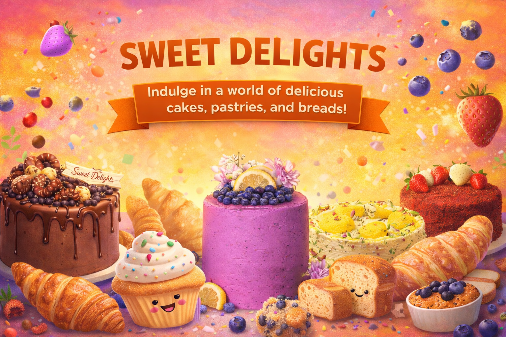
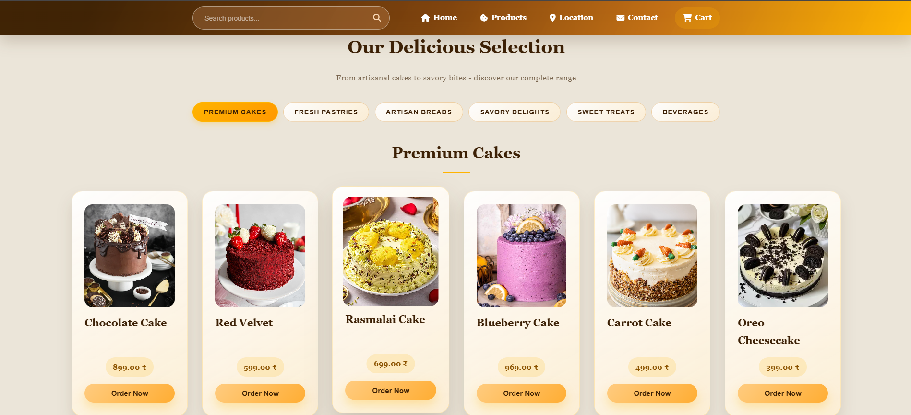
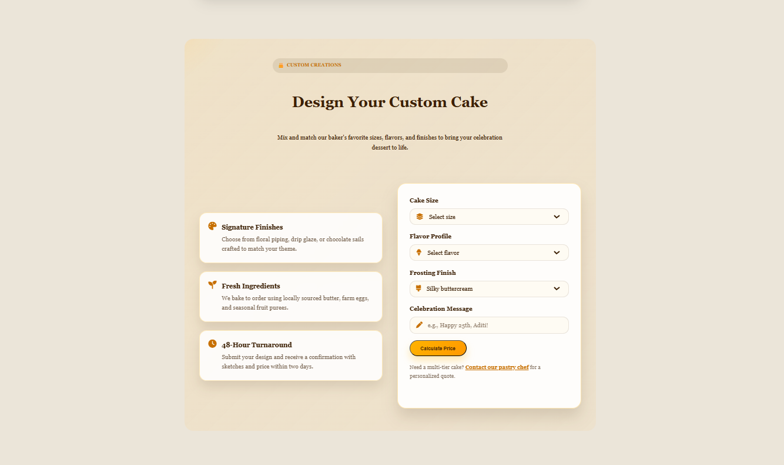
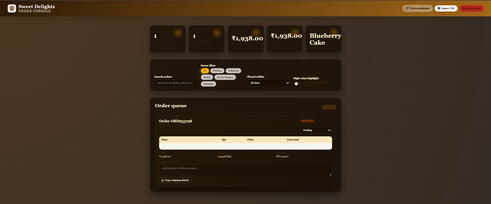

# 🍰 Sweet Delights Bakery



A modern, responsive bakery website featuring an elegant product catalog, interactive shopping cart, custom cake builder, blog section, and more. Built with vanilla HTML, CSS, and JavaScript for optimal performance and accessibility.

[](LICENSE)


---

## 🌟 Features

### 🛍️ Core Functionality
- **Dynamic Product Catalog** – Browse 40+ bakery items across categories (cakes, pastries, cookies, breads, desserts)
- **Interactive Shopping Cart** – Add, remove, and adjust quantities (max 3 per item) with live total calculation
- **Real-time Search** – Instant product filtering with category-aware search
- **Order Tracking** – Track your order status with order ID lookup
- **Custom Cake Builder** – Interactive form to design personalized cakes (flavor, size, frosting, toppings, message)

### 🎨 User Experience
- **Responsive Design** – Mobile-first approach with hamburger navigation, optimized layouts for phones, tablets, and desktops
- **Accessible Navigation** – ARIA-compliant mobile menu with focus trap, keyboard navigation (ESC to close), and screen-reader support
- **Hero Section** – Eye-catching landing with bakery highlights, CTAs, and featured product card
- **Seasonal Offers** – Rotating promotional banners (Valentine's, Summer, Holiday specials)
- **Customer Reviews** – Auto-scrolling testimonial marquee with pause-on-hover

### 📰 Content & Engagement
- **Blog Section** – Modal-based blog posts with baking tips, recipes, and stories
- **Location Finder** – Embedded Google Maps for store locations
- **Contact Form** – Email, phone, and social media links
- **Draggable Logo** – Fun interactive logo element

### 🔧 Technical Highlights
- **Vanilla JS** – No frameworks, lightweight, and fast
- **CSS Grid & Flexbox** – Modern layout system with mobile breakpoints (768px, 480px)
- **Font Awesome Icons** – Scalable vector icons throughout
- **Smooth Scroll** – Native `scroll-behavior: smooth` for anchor links
- **LocalStorage-ready** – Cart persistence structure (can be extended)

---

## 🚀 Live Demo

```
https://samirshaikh03.github.io/bakery-web/
```

---

## 📸 Screenshots

### Desktop View

*Elegant hero section with featured product and CTAs*

### Custom Cake Builder

*Interactive form to design personalized cakes*

### Admin Portal

*Powerful back‑office interface for managing products, orders, customers, and site content.*

---

## 🛠️ Tech Stack

------------------------------------------------------------------------------
|         Technology          |                   Purpose                    |
|-----------------------------|----------------------------------------------|
| **HTML5**                   | Semantic markup with ARIA roles              |
| **CSS3**                    | Custom properties, Grid, Flexbox, animations |
| **JavaScript (ES6+)**       | DOM manipulation, event handling, cart logic |
| **Font Awesome 6.6.0**      | Icon library                                 |
| **Google Fonts (Georgia)**  | Typography                                   |
------------------------------------------------------------------------------

---

## 📦 Installation & Setup

### Prerequisites
- A modern web browser (Chrome, Firefox, Safari, Edge)
- (Optional) A local server for testing (VS Code Live Server, Python HTTP server, etc.)
---

## 📂 Project Structure

```
Bakery_Website/
├── bakery.html                    # Main HTML file
├── admin.html                     # Admin/backend interface (placeholder)
├── css/
│   └── bakery.css                 # Responsive styles (1873 lines)
├── js/
│   └── bakery.js                  # Core functionality (465 lines)
├── assets/                        # Product images, logos, icons
│   ├── Sweet_Delight_logo.png
│   ├── Sweet_Delight_icon.png
│   ├── Chocolate_cake.webp
│   └── ... (40+ product images)
├── LICENSE                        # Apache 2.0 License
├── README.md                      # Project documentation
└── .gitignore                     # Git ignore rules
```

---

## 🎯 Usage Guide

### For Customers

1. **Browse Products**
   - Scroll to the "Our Products" section or click `Products` in the nav
   - Use the search bar to filter items by name or category

2. **Add to Cart**
   - Click `Order Now` on any product
   - Adjust quantities using `+` / `-` buttons (max 3 per item)
   - View cart total and proceed to checkout

3. **Design a Custom Cake**
   - Click `Design a Custom Cake` in the hero section
   - Select flavor, size, frosting, toppings, and add a message
   - Submit the form to receive a quote

4. **Track Orders**
   - Enter your order ID in the "Track Your Order" section
   - View real-time status updates

5. **Read Blog Posts**
   - Scroll to the "From Our Kitchen" blog section
   - Click on any post to open the modal reader

### For Developers

- **Cart Logic:** See `addToCart()`, `updateQuantity()`, `showCart()` in `js/bakery.js`
- **Search:** `searchProducts()` filters products by name and category attributes
- **Mobile Menu:** `setMenuState()` manages focus trap, ESC handling, and ARIA states
- **Custom Cake Form:** `submitCakeOrder()` captures form data (extend for backend API)

---

## 🧩 Features Roadmap

- [ ] Backend integration (Node.js/Express or Firebase)
- [ ] User authentication (login/signup)
- [ ] Payment gateway (Stripe, Razorpay)
- [ ] Persistent cart (LocalStorage or database)
- [ ] Admin dashboard for product/order management
- [ ] Email notifications for orders
- [ ] Dark mode toggle
- [ ] Progressive Web App (PWA) features

---

---

## 🐛 Bug Reports & Feature Requests

Found a bug or have a feature idea?

1. Check [existing issues](https://github.com/your-username/Bakery_Website/issues)
2. If not found, [open a new issue](https://github.com/SamirShaikh03/Bakery_Website/issues/new)
3. Include:
   - Browser/OS version
   - Steps to reproduce
   - Expected vs. actual behavior
   - Screenshots (if applicable)

---

## 📜 License

This project is licensed under the **Apache 2.0 License** – see the [LICENSE](LICENSE) file for details.

**TL;DR:** You can use, modify, and distribute this project freely, just keep the copyright notice.

---

## 🙏 Acknowledgments

- **Font Awesome** – Icon library ([fontawesome.com](https://fontawesome.com))
- **Google Fonts** – Typography
- **Unsplash / Pexels** – Product imagery inspiration (replace with actual credits if using specific images)
- **Community** – Thanks to all contributors and users!

---

## 📊 Project Stats

- **Lines of Code:** ~8,500+
- **Product Images:** 40+
- **Categories:** 5 (Cakes, Pastries, Cookies, Breads, Desserts)
- **Responsive Breakpoints:** 768px (tablet), 480px (mobile)

---

<div align="center">

**Made with ❤️ and 🍰 by Samir Shaikh **

⭐ Star this repo if you found it helpful!

[Report Bug](https://github.com/samirshaikh03/Bakery_Website/issues) · [Request Feature](https://github.com/samirshaikh03/Bakery_Website/issues) · [View Demo](https://samirshaikh03.github.io/Bakery_Website/)

</div>
